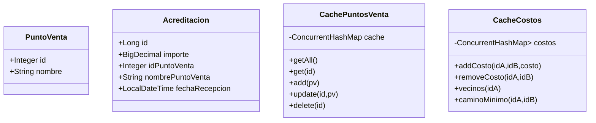
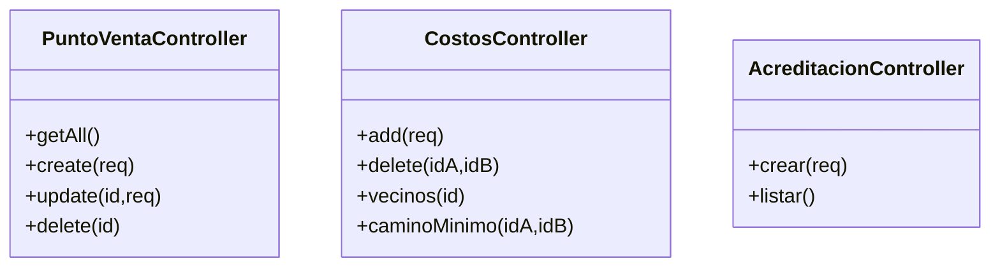
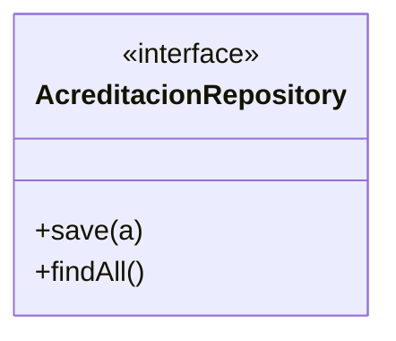

# DIAGRAMAS



# Controllers



# Services
(Si querés agregar servicios, acá ponés otro bloque mermaid)

# Repository



# DIAGRAMA BBDD

```mermaid
erDiagram
    ACREDITACIONES {
        BIGINT id PK
        DECIMAL importe
        INT idPuntoVenta
        VARCHAR nombrePuntoVenta
        TIMESTAMP fechaRecepcion
    }
    
    %% ======= CONEXIONES =======
PuntoVentaController --> CachePuntosVenta : usa
CostosController --> CacheCostos : usa
AcreditacionController --> CachePuntosVenta : valida PV
AcreditacionController --> AcreditacionRepository : guarda en BD

CachePuntosVenta --> PuntoVenta : contiene
AcreditacionRepository --> Acreditacion : persiste
CacheCostos --> Camino : genera camino mínimo

%% ======= CONEXIONES =======
PuntoVentaController --> CachePuntosVenta : usa
CostosController --> CacheCostos : usa
AcreditacionController --> CachePuntosVenta : valida PV
AcreditacionController --> AcreditacionRepository : guarda en BD

CachePuntosVenta --> PuntoVenta : contiene
AcreditacionRepository --> Acreditacion : persiste
CacheCostos --> Camino : genera camino mínimo
```
