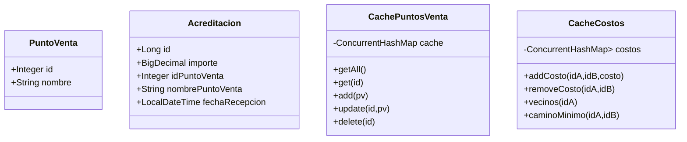

#DIAGRAMAS

```mermaid
classDiagram
#Controllers#
class PuntoVentaController {
+getAll()
+create(req)
+update(id,req)
+delete(id)
}


classDiagram
class CostosController {
+add(req)
+delete(idA,idB)
+vecinos(id)
+caminoMinimo(idA,idB)
}


class AcreditacionController {
+crear(req)
+listar()
}
```markdown
#Services#

#Repository
```mermaid
class AcreditacionRepository {
<<interface>>
+save(a)
+findAll()
}
```
```mermaid

##DIAGRAMA BBDD##

erDiagram
    ACREDITACIONES {
        BIGINT id PK
        DECIMAL importe
        INT idPuntoVenta
        VARCHAR nombrePuntoVenta
        TIMESTAMP fechaRecepcion
    }